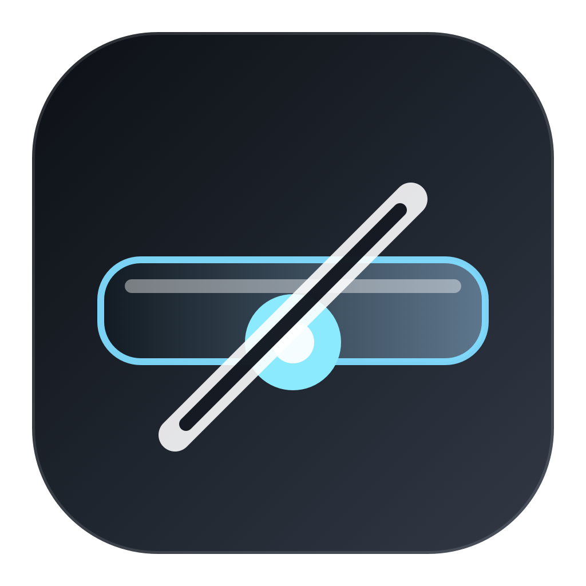
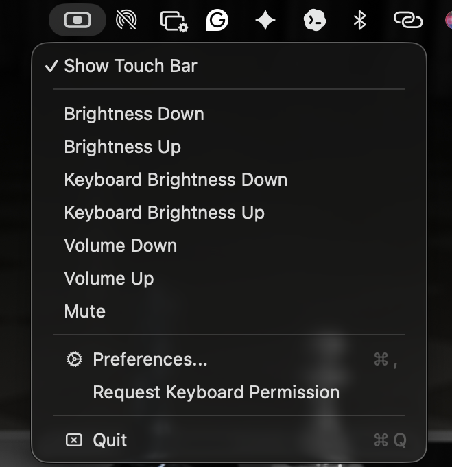
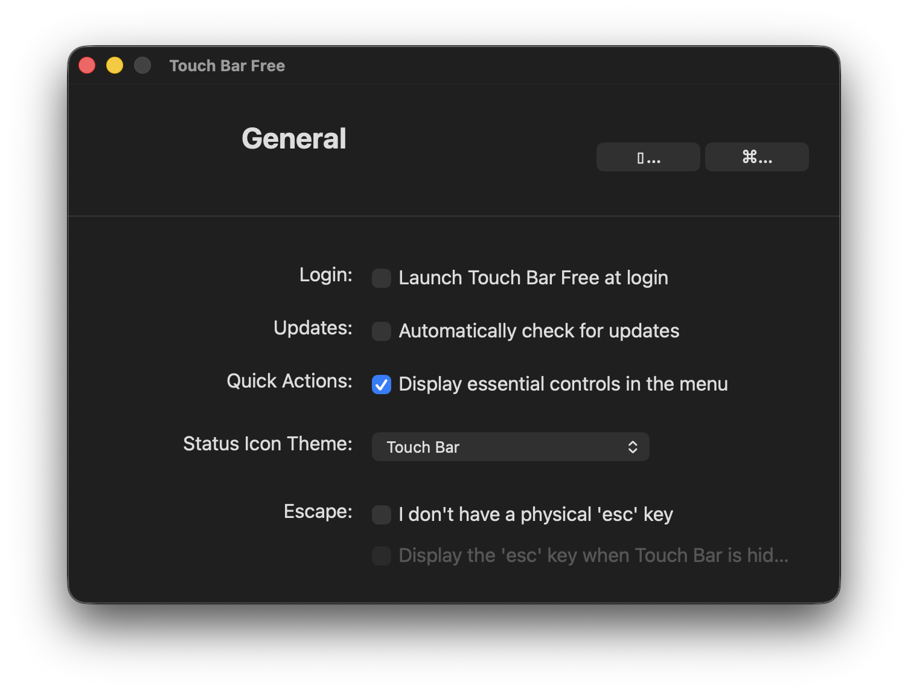
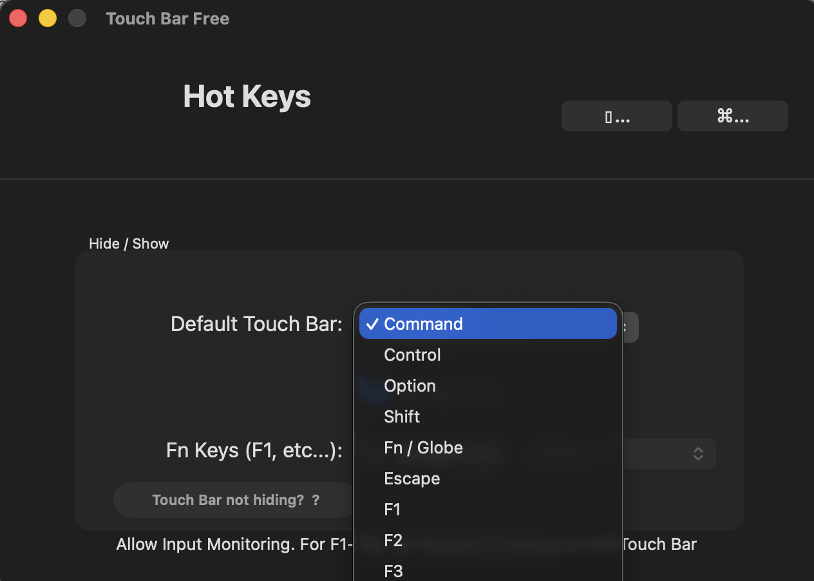
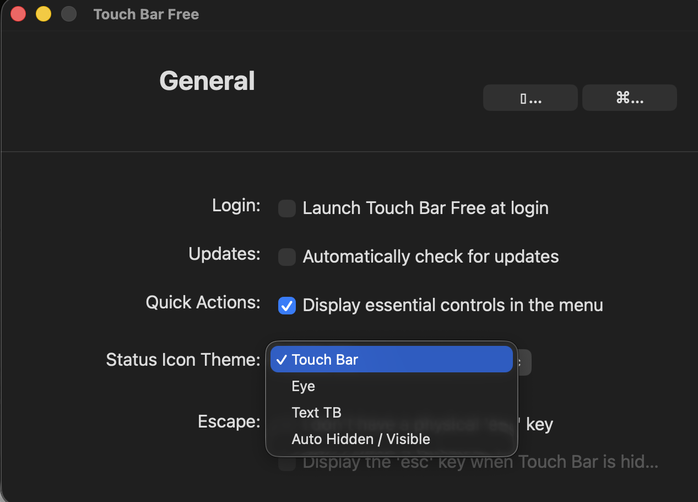

# Hide My Touch Bar

<p align="center">
  
</p>

<h3 align="center">
Hide the MacBook Touch Bar instantly.
</h3>

<p align="center">
A lightweight macOS utility for a cleaner, distraction-free keyboard workflow.
</p>

<p align="center">
  
  
  
</p>

---

## Download

<p align="center">
  <a href="https://github.com/shiv3130/Hide-My-Touch-Bar/releases/latest">
    
  </a>
</p>

<p align="center">
Download the latest macOS `.dmg` installer from the Releases page.
</p>

---

## Preview
---

### Menu Bar Controls

<p align="center">
  
</p>

<p align="center">
Quick access to Touch Bar controls directly from the macOS menu bar.
</p>

### General Settings

<p align="center">
  
</p>
---

### Hotkey Configuration

<p align="center">
  
</p>

---

### Menu & Status Icon Options

<p align="center">
  
</p>

---

## Why?

The MacBook Touch Bar can sometimes feel:

- distracting
- inconsistent
- easy to trigger accidentally
- slower than physical function keys

Hide My Touch Bar helps restore a cleaner and more predictable workflow.

Perfect for:

- developers
- writers
- productivity-focused users
- external keyboard users
- minimalist desktop setups

---

## Features

- Hide the Touch Bar instantly
- Lightweight macOS utility
- Native-style dark interface
- Custom hotkeys
- Menu bar integration
- Multiple status icon themes
- Startup launch support
- Minimal CPU and memory usage

---

## Installation

### Download DMG

👉 [Download Latest Release](https://github.com/shiv3130/Hide-My-Touch-Bar/releases/latest)

---

### Install

1. Download the `.dmg`
2. Open the installer
3. Drag **Hide My Touch Bar.app** into Applications
4. Launch the app

---

## Build From Source

### Clone Repository

```bash
git clone https://github.com/shiv3130/Hide-My-Touch-Bar.git
cd Hide-My-Touch-Bar
```

### Install Dependencies

```bash
npm install
```

### Run Development Mode

```bash
npm start
```

### Build App

```bash
npm run build
```

---

## Create DMG Installer

Install `create-dmg`:

```bash
brew install create-dmg
```

Generate DMG:

```bash
create-dmg \
--volname "Hide My Touch Bar" \
--window-size 600 400 \
--icon-size 100 \
--app-drop-link 450 185 \
"HideMyTouchBar.dmg" \
"Hide My Touch Bar.app"
```

---

## Supported macOS Versions

- macOS Monterey
- macOS Ventura
- macOS Sonoma
- macOS Sequoia

Supports:

- Intel Macs
- Apple Silicon Macs

---

## Roadmap

Planned improvements:

- Auto-hide mode
- Per-app Touch Bar profiles
- Better keyboard shortcut customization
- Startup optimization
- Apple Shortcuts support
- Improved animations and transitions

---

## Contributing

Contributions are welcome.

1. Fork the repository
2. Create a branch
3. Commit changes
4. Open a Pull Request

---

## License

MIT License

---

## Disclaimer

This project is not affiliated with or endorsed by Apple Inc.

---

## Author

Venkata(Shiva) GogiReddy
